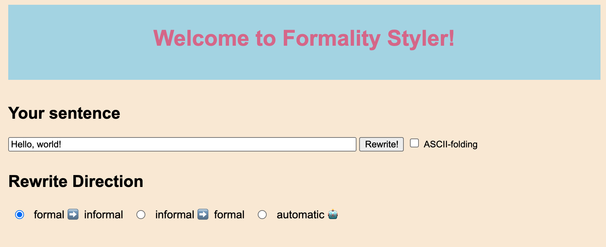

# Formality Styler

An application that can classify user input as formal (e.g. "I find it amusing") or informal (e.g. "lol") and suggest the rewrite in the other formality level.

The hope is to provide a tool for ESL students to understand formality and, in general, for every English speaker to achieve effective communication under situations with varying formality requirements.

Code includes training for formality classifier (fasttext model) and style rewriter (tranformer model trained with fairseq) on [Grammarly's Yahoo Answers Formality Corpus (GYAFC)](https://arxiv.org/abs/1803.06535) and deploying the models via web UI (Flask and Jinja). 

This is the Capstone Project for my Master's degree in Computational Linguistics. 

**UI demo (gif)** 


**Documentations**

- [project presentation slides](https://docs.google.com/presentation/d/1Of4xggftqHpqkNu3ScqmyCKTcWLXGX_xYwy8eH4FVXA/edit?usp=sharing): information on background, system overview, result analysis, and deployment
- [presentation rehearsal recording](https://drive.google.com/file/d/1FVtSmmfepF_tAQNSIuBBQ90phF0vdBa5/view?usp=sharing) (available to Brandeis accounts only): the actual presentation was not recorded, so here's a recording of myself rehearsing
- [final project writeup](doc/project_writeup.pdf): conference-proceeding-style writeup that briefly describes the project
- [test set rewrite output](https://docs.google.com/spreadsheets/d/1IAvSQ_EjUZaAXhmhohLXbTaJTUXgigtiuWhpsCKGo7E/edit?usp=sharing) (available to Brandeis accounts only): full list of test output of both the deployed transformer model and a less effective, VAE-based approach

# Training Models

We trained a formality classifier (fasttext model) and two sequence-to-sequence rewrite models (tranformer model trained with fairseq).

Go to [training/](./training) folder to see a detailed documentation for preprocessing, training, and result analysis. 

# How to Run

## Prerequisites
To save time, you can execute the following three subsections at the same time. 
### Python Packages
First, create a virtual environment with **Python 3.7** using either [venv](https://packaging.python.org/guides/installing-using-pip-and-virtual-environments/#creating-a-virtual-environment) or [conda](https://conda.io/projects/conda/en/latest/user-guide/tasks/manage-environments.html#creating-an-environment-with-commands) (I personally prefer conda).
> Make sure it's **Python 3.7**!! This project uses 3.7.4 to be exact.

Then, you should be able to install all the packages by running the following command, after you ```cd <project root>```:
```shell script
pip install -r requirements.txt 
```

The command will install the packages you'll need to run the project, namely:
* [attrs 21.2.0](https://pypi.org/project/attrs/)
* [flask 1.1.2](https://flask.palletsprojects.com/en/1.1.x/)
* [fairseq 0.10.2](https://pypi.org/project/fairseq/)
    * make sure ```INPUT_PROMPT``` in [consts.py](consts.py) is exactly the same as what you see in [Fairseq test run](#fairseq-model-test-run) if using a different version!
* [fold-to-ascii 1.0.2.post1](https://pypi.org/project/fold-to-ascii/)
* [pexpect 4.7.0](https://pypi.org/project/pexpect/)
* [web.py 0.62](https://pypi.org/project/web.py/)
* [requests 2.25.1](https://pypi.org/project/requests/)


### Required Files
The following documents are required:
* Fairseq models for both directions
* Code file and dictionaries for Byte-pair Encoding (BPE)

You can obtain the zip file containing all these document and put them in the correct structure by running the following commands at project root, after you ```cd <project root>```:
```shell script
wget -O fairseq_data.tar.gz https://www.dropbox.com/s/frq8l6h073jvu6w/fairseq_data.tar.gz?dl=1
tar -xf fairseq_data.tar.gz && rm fairseq_data.tar.gz
```
The script above will result in one more folder under project root, [fairseq_results](fairseq_results).

### Build Docker Image
First, if you haven't already, [install docker](https://docs.docker.com/get-docker/) and run Docker daemon (i.e. open your docker desktop client). 

Then, build the docker image for the fastText classifier by running
```shell script
cd classifier_docker
docker build -t rewriter .
```
This might take a couple of minutes. Now the docker image will be ready for running. 

## Fairseq Model Test Run
This section is not required for running the project, but is instead intended for testing purpose only.

To test if the fairseq translation model can run as expected, run the following fairseq-cli command at project root. 
```shell script
fairseq-interactive data-bin/informal-formal \
                      --path fairseq_results/informal-formal/checkpoint_best.pt \
                      --beam 5 --source-lang informal --target-lang formal \
                      --bpe subword_nmt --bpe-codes data-bin/bpe_code \
                      --tokenizer moses --moses-target-lang en \
                      --remove-bpe
```
The program should print several lines of messages about program parameters, dictionary sizes, and start waiting for user input after this exact string:

```Type the input sentence and press return:```

You should be able to type in an informal sentence, hit enter, and wait for the program to print several lines of rewrite output and probabilities, consisting of (S)ource, (W)all time, (H)ypothesis, (D)etokenized hypothesis, and (P)osition-wise log likelihood.

### Example Interaction with Fairseq
The example console output below shows what happens if you run the ```fairseq-interactive``` command above, wait for the ```Type the input sentence and press return:``` string to show up, and enter ```hiya, world!```.
```
2021-05-02 23:50:53 | INFO | fairseq.tasks.translation | [informal] dictionary: 10032 types
2021-05-02 23:50:53 | INFO | fairseq.tasks.translation | [formal] dictionary: 9792 types
2021-05-02 23:50:53 | INFO | fairseq_cli.interactive | loading model(s) from fairseq_results/informal-formal/checkpoint_best.pt
2021-05-02 23:50:56 | INFO | fairseq_cli.interactive | NOTE: hypothesis and token scores are output in base 2
2021-05-02 23:50:56 | INFO | fairseq_cli.interactive | Type the input sentence and press return:
hiya, world!
S-0     hiya , world !
W-0     0.242   seconds
H-0     -0.7625648975372314     Hi yes , world !
D-0     -0.7625648975372314     Hi yes, world!
P-0     -2.0801 -1.0306 -0.4909 -0.3452 -0.4730 -0.1554
```
## Starting the System
After the first time set up and tests are done, you can follow this section to start the system every time you wish to use the system. 
### Run Docker Container
To start the Docker container for classifier: 

1. Make sure docker daemon is running

2. Then, run:

   ```bash
   docker run -p 2500:8081 rewriter
   ```

If you wish to change the host port number, do the following:
* go to [styler.py](./styler.py) and change the host port ```HOST_PORT``` number
* change the docker run command to the following and run the command
    ```shell script
    docker run -p <HOST_PORT>:8081 rewriter
    ```
    Now your docker will be up and listening.
### Open webpage
To start the Flask App, simply run
```shell script
python app.py
```
and go to http://127.0.0.1:3500/. 

If you'd like to specify a port other than 3500, run 
```shell script
python app.py --port <port number>
```
go to http://127.0.0.1:<port number\>/ instead. A Chrome browser is recommended over Safari for a better experience.

Once you open the web page (it might take a few seconds to a minute to load depending on your computer), you should see an interface similar to the screenshot below:


# Interacting with the System
To use the web-based styler tool, do the following:
1. Type in your input sentence
2. If your input contains non-ASCII characters, you might want to select ASCII-folding checkbox
3. Choose your rewrite direction, or choose "automatic" to let the classifier decide your input style and choose the corresponding direction for you.
4. Click "Rewrite!" to generate output!
> Note: if you hit "rewrite" button too fast, the fairseq process might break, causing the webpage to restart from home page.

# Project Structure
## Classifier
This project uses a fastText classifier for predicting the binary formality of the input. 
The classifier is wrapped as an HTTP server with ```web.py``` and ```requests``` and deployed via Docker. 

Files and code involved:
* [classifier_docker](classifier_docker/) for the docker image and server code
* [styler.py](styler.py) for client-side Classifier class

## Rewriter
To rewrite text from informal to formal or from formal to informal, we use ```fairseq-interactive``` to generate output with two transformer models, one for each direction. Interaction with the fairseq CLI is done with ```pexpect```. 

Files and code involved:
* [styler.py](styler.py) for Generator class that wraps around a child process spawned for ```fairseq-interactive```, sends user input to it, and reads output from it
* [data-bin](data-bin) containing dictionaries for decoding the user input text
* [fairseq_results](fairseq_results) containing the transformer models saved as .pt files

## Web UI
To create a web-based tool that combines the classifier and rewriter on a graphic interface, we use ```flask```.

Files and code involved:
* [templates](templates) for HTML templates
* [app.py](app.py) for handling web UI interaction

# FAQ
## Why bother with non-ASCII input?

**Demo: without and with ASCII-folding**


Our model and BPE tokenizer is train on a very clean corpus, in that the input sentences are all ASCII. This means that, even if we assume English-only input from the user, there might be words with diacritics (e.g. Zoë, façade) that will not be recognized by the tokenizer, and the non-ASCII word will be considered as an out-of-vocabulary token and converted into unknown tokens by the tokenizer.

For example, "i think her name's Zoë" will be tokenized into "i think her name ' s Zo\<unk\>", causing the rewriter model to generate unexpected output such as "I think her name is Zoboyfriend." 

Therefore, the restyler addresses this by using a technique similar to [ASCII folding filter in ElasticSearch](https://www.elastic.co/guide/en/elasticsearch/reference/current/analysis-asciifolding-tokenfilter.html) using a Python package called [fold-to-ascii](https://pypi.org/project/fold-to-ascii/). To enable ASCII-folding, the user can check the "ASCII-folding" box on the Web UI; the input string from the user will be first and foremost ASCII-folded before being passed to the model (and the classifier if in automatic mode). 

In this way, after ASCII-folding,  "i think her name's Zoë" is first folded into  "i think her name's Zoe", and then fed to the model, which generates the correct out "I think her name is Zoe."

## app.py: Address already in use
When starting [app.py](app.py), messages like ```[Errno 48] Address already in use``` can show up when the port has been occupied due to improper closing. 

To close the port, you'll need to terminate the occupying process: 
* First, find the process occupying it with 
    ```
    $ lsof -i:<port number>
    ```
* In the printed list of processes, locate the process ID (PID) of the Python process occupying this port.
* Use the following command to terminate the process and free up the port:
    ```
    $ kill <PID>
    ```
## Why use Docker for the classifier?
Initially, I chose to dockerize the classifier and run it as a server in the docker container, because the python-based fastText refused to install on my local machine... :( 

In the ideal world, we should be able to dockerize the entire project, but ```fairseq-interactive``` does not recognize ```--path```... we'll look into it when time permits.
> Note: Turns out I had the wrong ```fairseq-interactive``` version and it's incompatible with python 3.9. Maybe if we change the python version in the docker image, we can dockerize the entire project after all.

# Acknowledgements
This project cannot be realized without the generous guidance from Prof. Constantine Lignos. 

The implementation details of this project are also drawn from multiple sources on the internet, so thanks, modern information retrieval technology. 

Special thanks to Xiaoyu Lu for testing out the system, probing the docker problem with ```fairseq-interactive```, and contributing examples and memes for my presentation :P
